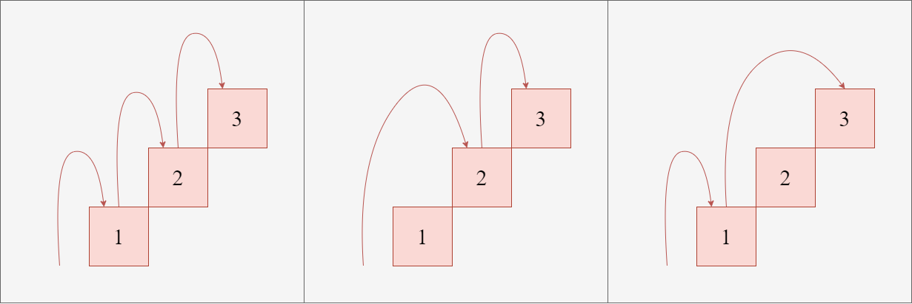
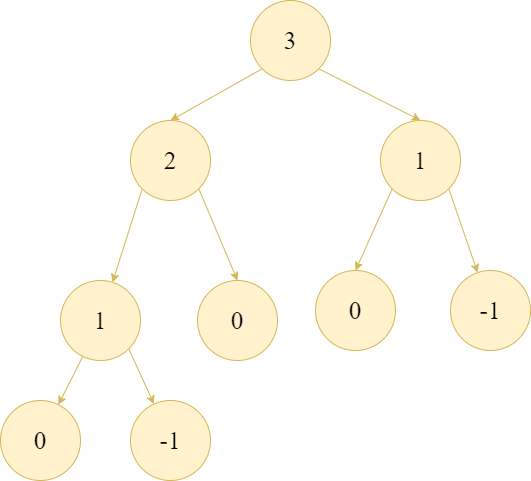

# 基礎動態規劃

在枚舉法中，我們說暴力是一個可以保證正確性的解法，只要給他足夠的時間，幾乎可以解決世界上所有的問題。但枚舉法的問題是所花費的時間太多了，我們先來看看怎麼用暴力搜尋法解決問題，再看看我們如何從中找到可以優化的地方，最終得出動態規劃的概念。

!!! note "例題"
    假設你正在爬樓梯，
    需要走 $n$ 階才能走到樓頂，
    因為腳長跟安全問題每次最多跨 $1$ 階或 $2$ 階，
    請問走到樓頂有幾種方法?

    - $1 \le n \le 50$

以 $n = 3$ 為例，
我們有以下幾種走法：

- 1, 1, 1
- 1, 2
- 2, 1



如上圖所示，
我們走到第三階有兩種可能：

- 從第二階走一階上去
- 從第一階走兩階上去

那走到第二階又有兩種可能：

- 從第一階走一階上去
- 從零階走兩階上去

因此，我們其實可以發現，
走到第 $n$ 階的方法數量等於走到第 $n-1$ 階的方法數量加上走到第 $n-2$ 階的方法數量，
也就是說我們可以用以下的遞迴式來表示：
$$
f(n) = f(n-1) + f(n-2)
$$

以程式碼來表示就是：
```kotlin
fun countWays(i: Int): Long =
    when
    {
        i == 0 -> 1L // 找到一種從第 0 階出發的合法走法
        i < 0 -> 0L  // 非法走法
        else -> countWays(i - 1) + countWays(i - 2)
    }
```

因為對於每個 $i$，
我們都會需要計算出 $f(i-1)$ 和 $f(i-2)$ 的值，
遞迴樹的節點數呈指數成長，因此時間複雜度可以上界為 $\mathcal{O}(2^n)$，
現在的效率是很差的，無法通過 $n = 50$ 的測試，
因此我們需要想辦法優化。

<figure markdown="span">

</figure>

從上圖的遞迴過程中可以發現，有很多問題在遞迴過程中被重複計算了，
我們可以用額外的空間來記錄已經計算過的值嗎。

我們可以用一個陣列來記錄每個 $f(i)$ 的值，
這樣就可以避免重複計算，因為只要求出 $1 \sim n $ 的值，
每個狀態只會被計算一次，而每次轉移只需要常數時間，所以時間複雜度會降為 $\mathcal{O}(n)$。

這個技巧我們稱為記憶化搜尋 (Memoization)，
也就是在遞迴的過程中記錄已經計算過的值，
這樣就可以避免重複計算，提升效率。

```kotlin
fun countWays(n: Int): Long
{
    val dp = LongArray(n + 1) { -1L }

    fun solve(i: Int): Long =
        when
        {
            i == 0 -> 1L
            i < 0 -> 0L
            dp[i] != -1L -> dp[i]
            else ->
            {
                val answer = solve(i - 1) + solve(i - 2)
                dp[i] = answer
                answer
            }
        }

    return solve(n)
}
```

因為純遞迴的方法在 kotlin 容易超時，所以我們改採用 kotlin 在 1.4 之後版本新提供的 `DeepRecursiveFunction`

??? "Revision Version"

    ```kotlin
    fun countWays(n: Int): Long
    {
        val dp = LongArray(n + 1) { -1L }
    
        val solve = DeepRecursiveFunction<Int, Long> { i ->
            when
            {
                i == 0 -> 1L
                i < 0 -> 0L
                dp[i] != -1L -> dp[i]
                else ->
                {
                    val answer = callRecursive(i - 1) + callRecursive(i - 2)
                    dp[i] = answer
                    answer
                }
            }
        }
    
        return solve(n)
    }
    ```
    DeepRecursiveFunction<Int, Long> 第一個 Int 代表輸入的參數型態，第二個 Long 代表回傳型態，形式上跟一般遞迴幾乎相同。
    
那麼，在記憶化搜尋的過程中，我們發現答案會從 $f(1), f(2), \ldots, f(n)$ 一直被計算到 $f(n)$，
也就是先得出小 $i$ 的值，再慢慢累積到大 $i$ 的值，
這樣的過程其實可以用迴圈來實現，由小到大計算每個值，
這樣就不需要遞迴了，時間複雜度還是 $\mathcal{O}(n)$。

```kotlin
fun countWays(n: Int): Long
{
    val dp = LongArray(n + 1)
    dp[0] = 1L

    for (i in 1..n)
    {
        dp[i] = when (i)
        {
            1 -> 1L
            else -> dp[i - 1] + dp[i - 2]
        }
    }

    return dp[n]
}
```

筆者個人不喜歡額外做判斷，容易出錯，
因為轉移方程式已經包含了所有的情況，
所以比較喜歡所有的答案都是透過轉移方程式計算出來的。

因為 $f(i) = f(i-1) + f(i-2)$ 在 $i = 1$ 時會因為 $f(i - 2)$ 的部分導致陣列索引值有負號造成問題，
筆者喜歡將答案往右偏移兩格，變成 $f(i + 2) = f(i + 1) + f(i)$，
這樣就不會有負號的問題了，
因此我們可以將陣列的大小設為 $n + 3$，
這樣就可以避免負號的問題了。

```kotlin
fun countWays(n: Int): Long
{
    // dp[i + 2] 對應原本的 f(i)
    val dp = LongArray(n + 3)
    dp[1] = 0L // f(-1) = 0
    dp[2] = 1L // f(0) = 1

    for (i in 1..n)
        dp[i + 2] = dp[i + 1] + dp[i]

    return dp[n + 2]
}
```

因為要求解的問題中，有很多重疊的部分，所以透過用空間換取時間來優化演算法的時間複雜度，這樣技巧我們稱為動態規劃 (Dynamic Programming)，

第一種用遞迴從大問題開始拆解，慢慢計算出小問題的值，稱為自頂向下 (Top-Down) 的動態規劃，

第二種用迴圈從小問題開始計算，慢慢累積到大問題的值，稱為自底向上 (Bottom-Up) 的動態規劃，

這兩種方法都可以解決問題，但自底向上的方法通常更有效率，
因為它不需要額外的遞迴呼叫開銷，但是以初學者而言，可能會對遞迴的思維方式更容易理解。

## 動態規劃的概念

我們在求解問題的時候，從問題的答案往回推有時是會比較容易的，當我們發現將大問題拆解成小問題的時候，如果有很多問題是會被重複詢問的，那我們就可以透過動態規劃來解決這個問題。

適合使用動態規劃的問題通常具有以下特性：

1. **最優子結構 (Optimal Substructure)**：對最佳化問題而言，大問題的最佳解可以由適當子問題的最佳解組成。計數型 DP 不一定是在求「最優解」，但同樣需要能由子問題答案組合出原問題答案。
2. **重疊子問題 (Overlapping Subproblems)**：問題可以被拆解成多個子問題，這些子問題會被重複計算。
3. **狀態具有充分資訊**：一旦狀態被確定，後續轉移只需要依賴這個狀態，不需要知道到達它的完整歷史。這個性質有時也稱為無後效性。

因為這幾個特性，我們才可以透過空間換取時間，來大幅度減少計算的成本。

在計算時間複雜度的時候，我們通常會考慮以下幾個方面：

- **狀態數量**：我們需要考慮有多少種不同的子問題需要計算。
- **狀態轉移方程式**：我們需要考慮每個子問題的計算方式，通常是透過遞迴或迴圈來實現。
- **狀態轉移的時間複雜度**：我們需要考慮每個子問題的計算時間，通常是常數時間或線性時間。

因為動態規劃會使用額外空間記錄狀態，所以除了時間複雜度，也必須估計空間複雜度。能配置多少元素取決於記憶體限制與資料型別；例如 `LongArray(10_000_000)` 光資料本身就約需要 80 MB，不能只用元素數量判斷是否安全。

## 打家劫舍

!!! note "打家劫舍"
    現在有 $n$ 間房子，第 $i$ 間房子裡面有 $c_i$ 元的現金，
    現在有一個小偷要進去偷錢，
    當某個房子被偷時，相鄰的兩間房子的主人會提高警覺，
    如果小偷進去了相鄰的房子就會被抓到，
    請問小偷在不被抓的情況下，能偷到最多多少錢?

    - $1 \le n \le 10^5$
    - $1 \le c_i \le 10^9$

假設 $c = [2, 7, 9, 3, 1]$

選擇偷第 $1, 3, 5$ 間房子是最好的，
可以得到 $2 + 9 + 1 = 12$ 的錢。

我們要先確立好問題是什麼，這問題其實跟子集合枚舉有點像，
只是加上了相鄰數字不能同時被選取的限制，
因此我們可以用遞迴的方式來解決這個問題。

一開始你可能會想要這樣設計遞迴式，

$f(\text{第一間房子偷與不偷}, \text{第二間房子偷與不偷}, \ldots, \text{第 n 間房子偷與不偷})$ 代表對於這 $n$ 間房子，
偷與不偷的所有組合下能獲得的最大金額，
首先這個遞迴有一個明顯的問題，就是參數數量是不確定的，
這樣沒有一個簡單的方法可以轉程式碼跟設計轉移方程式。

那麼用二進位的方法來表示每一間房子偷與不偷的狀態呢？
$f(i, s)$ 代表前 $i$ 間房子在狀態 $s$ 下能獲得的最大金額，
這樣的話 $s$ 會是一個 $n$ 位元的數字，
最多只能考慮約 $n = 20$ 的情況，
還無法解決我們的問題。

所以我們繼續深入思考，第 $i$ 間房子能否偷取，只跟左右兩間房子有關，
跟更遠的房子沒有關係，所以我們只要維護最近的兩間房子的狀態就可以了，
如果我們從後面開始考慮，
- 如果第 $i$ 間房子偷了，那麼答案會從第 $i-1$ 間房子不偷的答案加上第 $i$ 間房子的錢，
- 如果第 $i$ 間房子不偷，那麼答案會從第 $i-1$ 間房子偷或不偷的答案中取最大的值。

因此我們可以設計出以下的轉移方程式：

$f(i, s = 0) = \max(f(i - 1, 0), f(i - 1, 1))$ <br>
$f(i, s = 1) = f(i - 1, 0) + c_i$

這裡的 $s$ 代表第 $i$ 間房子是否偷取，
- 如果 $s = 1$，代表第 $i$ 間房子被偷了，
- 如果 $s = 0$，代表第 $i$ 間房子沒有被偷。

我們可以用一個陣列來記錄每個房子被偷或不被偷的最大金額，
因此總共有 $2n$ 種狀態，每個狀態最多只要知道兩個狀態的值，而且可以馬上得知，所以時間複雜度為 $\mathcal{O}(n)$，
空間複雜度為 $\mathcal{O}(n)$。

### 狀態優化

定義新的子問題 $g(i) = \max(f(i, 0), f(i, 1))$，
也就是第 $i$ 間房子偷或不偷的最大金額，
那麼我們可以將轉移方程式簡化為：

若第 $i$ 間房子不偷，答案就是前 $i-1$ 間房子的最佳答案 $g(i-1)$；若第 $i$ 間房子要偷，第 $i-1$ 間就不能偷，因此答案是前 $i-2$ 間房子的最佳答案再加上 $c_i$，也就是 $g(i-2)+c_i$。所以轉移方程式可以簡化為：
$$
    g(i) = \max(g(i - 1), g(i - 2) + c_i)
$$

這樣可以把狀態減少一半，用白話文來理解的話就是，
- 如果第 $i$ 間房子偷了，那麼答案會從第 $i-2$ 間房子偷或不偷的答案加上第 $i$ 間房子的錢，
- 如果第 $i$ 間房子不偷，那麼答案會從第 $i-1$ 間房子偷或不偷的答案中過來。

使用陣列實作時，時間與空間複雜度分別是 $\mathcal{O}(n)$ 與 $\mathcal{O}(n)$；因為每次只依賴前兩個狀態，空間還可以進一步降為 $\mathcal{O}(1)$。
大家可以自己想一下遞迴的 base case 要怎麼設計，以及如何轉成 `Bottom-Up` 的方式來實作，後面還會介紹如何將 `Bottom-Up` 的陣列壓縮成常數空間；`Top-Down` 通常仍需保留記憶化陣列與遞迴呼叫堆疊。

## 最長遞增子序列 (Longest Increasing Subsequence, LIS)

!!! note "最長遞增子序列"
    給定一個長度為 $n$ 的整數序列，
    請問這個序列中，最長的遞增子序列長度是多少?

    - $1 \le n \le 10^3$
    - $1 \le a_i \le 10^9$

這裡要先介紹一個概念，**子序列**，
子序列是指從原始序列中選取一些元素，並保持它們的相對順序，
但不需要連續選取。
例如，對於序列 $[3, 1, 2, 5]$，子序列 $[3, 2, 5]$ 是一個合法的子序列，但 $[3, 5, 2]$ 不是，因為它們的相對順序被打亂了。

子序列其實就是選跟不選的問題，只是選了誰會變得很重要，會影響到之後的選擇，
這個問題有幾個關鍵的特性：
1. 自己一個元素的子序列長度是 $1$。
2. 如果 $a_i < a_j$，那麼 $a_i$ 可以成為 $a_j$ 的前一個元素，
   也就是說 $a_j$ 可以接在 $a_i$ 後面形成一個遞增子序列。
3. 因為求的是子序列，每一個索引值都可能是答案的結尾

而第二點其實就在暗示我們轉移方程式的設計，
如果我們要計算跟第 $i$ 個元素有關的子序列長度，
我們需要考慮所有 $j < i$ 的元素，
如果 $a_j < a_i$，那麼我們就可以將 $a_j$ 的子序列長度加上 $1$ 來計算
和第 $i$ 個元素有關的子序列長度。

這裡先看一個例子 ，假設我們有一個序列 $[1, 6, 7, 2, 5]$，
以 $5$ 為例，可以接在 $1, 2$ 後面形成遞增子序列，
因為 $1$ 前面沒有比它小的元素，但是 $2$ 前面有 $1$，
所以接在 $2$ 後面是比較好的，因為可以形成更長的遞增子序列，
我們可以將 $5$ 的子序列長度設為 $3$。

根據上面的例子，
我們可以發現每個元素的子序列長度都可以從前面的元素中計算出來，
因此我們可以用一個陣列來記錄每個元素為結尾的最長遞增子序列長度，
設計出以下的轉移方程式：
$$
f(i) = \max(f(j) + 1) \quad \forall j < i \land a_j < a_i
$$ 

這裡的 $f(i)$ 代表以第 $i$ 個元素結尾的最長遞增子序列長度，
我們可以用一個陣列來記錄每個元素的最長遞增子序列長度，
因此總共有 $n$ 種狀態，
每個狀態需要知道前面所有的狀態，
因此時間複雜度為 $\mathcal{O}(n^2)$，
空間複雜度為 $\mathcal{O}(n)$。

## 0-1 背包問題

0-1 背包問題是動態規劃中經典的問題之一，
它的目的是在給定一個背包的容量和一組物品的重量和價值的情況下，
選擇一些物品放入背包中，
使得背包中的物品總重量不超過背包的容量，
並且物品的總價值最大化。

!!! note "0-1 背包問題"
    現在有 $n$ 件物品，第 $i$ 件物品的重量為 $w_i$，價值為 $v_i$，
    現在有一個容量為 $W$ 的背包，
    請選擇若干物品，使總重量不超過 $W$，並讓物品的總價值最大化?
    
    - $1 \le n \le 10^3$
    - $1 \le w_i, v_i \le 10^5$
    - $1 \le W \le 10^5$


你仔細觀察後會發現，這也是一個典型的「選或不選」問題，
對於每個物品，我們可以選擇放入背包或不放入背包，
但是我們不用像 LIS 或者打家劫舍問題一樣需要考慮前後的關係，
我們只要知道當前剩下多少的容量就可以了，
因此我們可以用一個陣列來記錄每個容量下的最大價值，
設計出以下的轉移方程式：
$$
f(i, j) = \max(f(i - 1, j), f(i - 1, j - w_i) + v_i)
$$

這裡的 $f(i, j)$ 代表前 $i$ 件物品在容量為 $j$ 的背包中能取得的最大價值，如果我們想要放入第 $i$ 件物品，
我們需要確保背包的容量 $j$ 能夠容納第 $i$ 件物品的重量 $w_i$，
因此我們需要考慮兩種情況：
1. 不放入第 $i$ 件物品，這時候最大價值就是前 $i-1$ 件物品在容量為 $j$ 的背包中能取得的最大價值。
2. 放入第 $i$ 件物品，這時候最大價值就是前 $i-1$ 件物品在容量為 $j - w_i$ 的背包中能取得的最大價值加上第 $i$ 件物品的價值 $v_i$。

我們可以用一個二維陣列來記錄每個物品在每個容量下的最大價值，
因此總共有 $n \times W$ 種狀態，
每個狀態只需要查看上一層的兩個狀態，
因此時間複雜度為 $\mathcal{O}(n \times W)$，
空間複雜度為 $\mathcal{O}(n \times W)$。

### 空間優化

我們可以發現，對於每個物品的答案計算，只需要知道前一個物品的答案就好了，
在處理第 $i$ 件物品時，只需要知道 $f(i - 1, j)$ 和 $f(i - 1, j - w_i)$ 的值，$f(i - 2, j)$ 以及更早的狀態都不需要了，
我們可以使用兩個一維陣列做滾動；更進一步地，只要讓容量由大到小更新，就可以使用同一個一維陣列，將空間複雜度從 $\mathcal{O}(n \times W)$ 降到 $\mathcal{O}(W)$。容量必須倒序，否則同一件物品可能在同一輪被重複使用。

```kotlin
fun knapsack01(
    capacity: Int,
    weights: List<Int>,
    values: List<Long>
): Long
{
    val dp = LongArray(capacity + 1)

    weights.zip(values).forEach { (weight, value) ->
        for (currentCapacity in capacity downTo weight)
        {
            dp[currentCapacity] = maxOf(
                dp[currentCapacity],
                dp[currentCapacity - weight] + value
            )
        }
    }

    return dp[capacity]
}
```

## 無限背包問題

!!! note "無限背包問題"
    給定一個背包的容量 $W$ 和一組物品的重量和價值，
    請選擇若干物品，使總重量不超過 $W$，並讓物品的總價值最大化?
    每種物品可以放入無限多次。
    
    - $1 \le n \le 10^3$
    - $1 \le w_i, v_i \le 10^5$
    - $1 \le W \le 10^5$

這個問題跟 0-1 背包問題很像，但是在考慮放入物品時多了一個選項，
也就是放入物品 $i$ 之後，繼續考慮放入物品 $i$，
這樣轉移式就會變成這樣：

$$
f(i, j) = \max(f(i - 1, j), f(i, j - w_i) + v_i)
$$

這裡的 $f(i, j)$ 代表前 $i$ 件物品在容量為 $j$ 的背包中能取得的最大價值，
如果我們想要放入第 $i$ 件物品，
我們需要確保背包的容量 $j$ 能夠容納第 $i$ 件物品的重量 $w_i$，
因此我們需要考慮兩種情況：
1. 不放入第 $i$ 件物品，這時候最大價值就是前 $i-1$ 件物品在容量為 $j$ 的背包中能取得的最大價值。
2. 放入第 $i$ 件物品，這時候最大價值就是前 $i$ 件物品在容量為 $j - w_i$ 的背包中能取得的最大價值加上第 $i$ 件物品的價值 $v_i$。

第二種情況會幫我們考慮到所有可能放入的次數直到背包容量不足為止，
所以我們就不用特地枚舉放入的次數來做遞迴轉移，這樣實作上就會比較簡單。

同樣地，可以將空間複雜度降到 $\mathcal{O}(W)$。與 0-1 背包不同的是，無限背包的一維轉移要讓容量由小到大更新，才能在同一輪再次使用目前物品，
時間複雜度則和 0-1 背包問題一樣為 $\mathcal{O}(n \times W)$。

```kotlin
fun unboundedKnapsack(
    capacity: Int,
    weights: List<Int>,
    values: List<Long>
): Long
{
    val dp = LongArray(capacity + 1)

    weights.zip(values).forEach { (weight, value) ->
        for (currentCapacity in weight..capacity)
        {
            dp[currentCapacity] = maxOf(
                dp[currentCapacity],
                dp[currentCapacity - weight] + value
            )
        }
    }

    return dp[capacity]
}
```

## 最長公共子序列 (Longest Common Subsequence, LCS)

!!! note "最長公共子序列"
    給定兩個長度為 $n$ 和 $m$ 的字串 $s_1$ 和 $s_2$，
    請問這兩個字串的最長公共子序列長度是多少?
    
    - $1 \le n, m \le 10^3$
    - $s_1[i], s_2[j] \in \{\texttt{a-z}\}$

我們已經在前面知道何謂子序列了，那麼最長公共子序列就是在兩個字串中找出一個子序列，
使得這個子序列在兩個字串中都存在，並且長度最大。

給一個例子，假設 我們有兩個字串 $s_1 = \texttt{"abcda"}$ 和 $s_2 = \texttt{"cbda"}$，
它們的最長公共子序列長度為 $3$，例如 $\texttt{"bda"}$ 或 $\texttt{"cda"}$。

回顧一下我們上面所說的，子序列問題就是選或不選，
假設我們現在由後往前考慮，字串 $s_1$ 的第 $i$ 個字元和字串 $s_2$ 的第 $j$ 個字元相同，
是不是代表我們可以把這個字元加入到以字串 $s_1$ 的前 $i-1$ 個字元和字串 $s_2$ 的前 $j-1$ 個字元的最長公共子序列後面，

我們以 $f(i, j)$ 代表字串 $s_1$ 的前 $i$ 個字元和字串 $s_2$ 的前 $j$ 個字元的最長公共子序列長度，
那麼目前我們知道：
- 如果 $s_1[i-1] = s_2[j-1]$，那麼 $f(i, j) = f(i - 1, j - 1) + 1$。

那麼如果 $s_1[i-1] \neq s_2[j-1]$ 呢？
以剛才的例子來說，
$s_1[4] = \texttt{'d'}$ 和 $s_2[3] = \texttt{'a'}$，
但其實 $s_1[4]$ 可以跟 $s_2[2]$ 配對，而 $s_2[3]$ 也可以和 $s_1[3]$ 配對，
也就是說我們要保留兩種可能：捨棄 $s_1$ 的第 $i$ 個字元，或捨棄 $s_2$ 的第 $j$ 個字元，
因此我們可以設計出以下的轉移方程式：
- 如果 $s_1[i-1] \neq s_2[j-1]$，那麼 $f(i, j) = \max(f(i - 1, j), f(i, j - 1))$。

這樣我們就可以得到完整的轉移方程式：

$$
f(i, j) =
\begin{cases}
    f(i - 1, j - 1) + 1 & \text{if } s_1[i-1] = s_2[j-1] \\
    \max(f(i - 1, j), f(i, j - 1)) & \text{if } s_1[i-1] \neq s_2[j-1]
\end{cases}
$$

我們可以用一個二維陣列來記錄每個字串的最長公共子序列長度，
因為總共有 $n \times m$ 種狀態，
每個狀態可以在 $\mathcal{O}(1)$ 的時間內計算出來，
因此時間複雜度為 $\mathcal{O}(n \times m)$，
空間複雜度為 $\mathcal{O}(n \times m)$，當然也可以透過
滾動的方式將空間複雜度降到 $\mathcal{O}(\min(n, m))$。

## 構造解

有時候除了求出最小成本/最大價值以外，
題目還希望知道具體的解是什麼，像是選了哪些物品，
或者是最長公共子序列的具體內容。

以 0-1 背包問題為例，我們可以先用記憶化搜尋計算最佳值，再根據每個狀態的選擇反向構造其中一組最佳解。

```kotlin
import kotlin.DeepRecursiveFunction

data class KnapsackResult(
    val maximumValue: Long,
    val selectedItems: List<Int>
)

data class State(
    val i: Int,
    val remaining: Int
)

fun solveKnapsack(
    capacity: Int,
    weights: List<Int>,
    values: List<Long>
): KnapsackResult
{
    require(weights.size == values.size)

    val n = weights.size
    val unknown = -1L
    val dp = Array(n) { LongArray(capacity + 1) { unknown } }

    val solve = DeepRecursiveFunction<State, Long> { (i, remaining) ->
        if (i < 0)
            return@DeepRecursiveFunction 0L

        if (dp[i][remaining] != unknown)
            return@DeepRecursiveFunction dp[i][remaining]

        val skip = callRecursive(
            State(i - 1, remaining)
        )

        val take =
            if (weights[i] <= remaining)
                callRecursive(
                    State(i - 1, remaining - weights[i])
                ) + values[i]
            else
                Long.MIN_VALUE

        maxOf(skip, take).also {
            dp[i][remaining] = it
        }
    }

    val reconstruct = DeepRecursiveFunction<State, List<Int>> { (i, remaining) ->
        if (i < 0)
            return@DeepRecursiveFunction emptyList()

        val skip = solve(
            State(i - 1, remaining)
        )

        if (solve(State(i, remaining)) == skip)
        {
            callRecursive(
                State(i - 1, remaining)
            )
        }
        else
        {
            callRecursive(
                State(i - 1, remaining - weights[i])
            ) + i
        }
    }

    return KnapsackResult(
        maximumValue = solve(State(n - 1, capacity)),
        selectedItems = reconstruct(State(n - 1, capacity))
    )
}
```

這裡的 `selectedItems` 使用從 \(0\) 開始的索引。若題目使用從 \(1\) 開始的物品編號，輸出時將每個索引加一即可。

反向構造時，如果

$$
f(i,j)=f(i-1,j),
$$

代表不選第 \(i\) 件物品也能維持最佳值，因此可以往狀態 \((i-1,j)\) 移動；否則，第 \(i\) 件物品必須被選入目前構造的解，再往 \((i-1,j-w_i)\) 移動。

若兩種選擇的價值相同，上面的程式會優先不選第 \(i\) 件物品。這只是在多組最佳解之間固定一種輸出方式，不會影響最大價值。

## 題單

- [CSES](https://cses.fi/problemset/) 上 DP Section 破兩萬人寫的題目
