# 基礎圖論 Graph Theory

圖論（Graph Theory）研究的是：

> **物件之間的關係。**

例如：

* 城市之間有道路
* 電腦之間有網路
* 人與人之間有朋友關係
* 網頁之間有超連結
* 課程之間有先修關係

這些看似完全不同的問題，都可以抽象成一張圖：

$$
G=(V,E)
$$

其中：

* $V$：Vertex 的集合
* $E$：Edge 的集合

我們稱 $G$ 為一張 **Graph（圖）**。

---

## 從城市與道路開始

假設有五個城市：

$$
V={1,2,3,4,5}
$$

道路為：

$$
E=
{
(1,2),
(1,3),
(2,4),
(3,4),
(4,5)
}
$$

可以畫成：

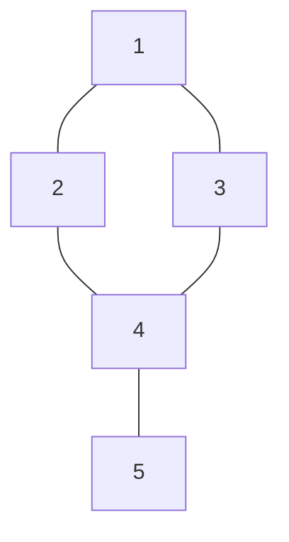

這裡：

* 城市是 **Vertex**
* 道路是 **Edge**

因此： $(1,2)\in E$

表示 Vertex $1$ 與 Vertex $2$ 之間存在一條 Edge。

---

## Vertex

Vertex 通常翻譯成：

> 頂點或節點

所有 Vertex 的集合通常記作： $V$


例如：

$$
V={1,2,3,4,5}
$$

Vertex 數量為： $|V|$

在程式中通常記作： $n$

---

## Edge

Edge 表示兩個 Vertex 之間的關係。

所有 Edge 的集合記作： $E$

例如：

$$
E=
{
(1,2),
(1,3),
(2,4)
}
$$

Edge 數量為： $|E|$

競賽中通常記作： $m$

---

## Undirected Graph

如果道路可以雙向通行：

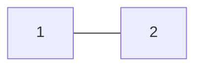

那麼：$(1,2)$ 與 $(2,1)$ 代表同一條 Edge。

這種 Graph 稱為：

> **Undirected Graph（無向圖）**

例如朋友關係通常可以視為 Undirected Graph。

---

## Directed Graph

有些關係具有方向。

例如：

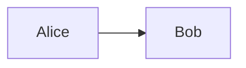

Alice 追蹤 Bob，不代表 Bob 也追蹤 Alice。

這種 Edge 稱為：

> **Directed Edge（有向邊）**

整張 Graph 則稱為：

> **Directed Graph（有向圖）**

通常寫成：$u\rightarrow v$

---

## Neighbor

如果存在： $(u,v)\in E$

那麼 $u$ 與 $v$ 稱為彼此的：

> **Neighbor（鄰居）**

例如：

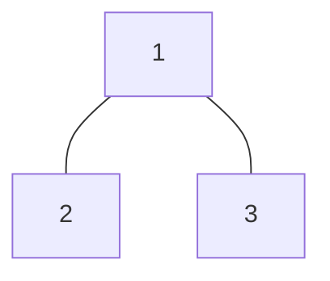

Vertex $1$ 的 Neighbor 為：$N(1)={2,3}$

---

## Degree

Vertex 連接多少條 Edge，稱為：

> **Degree（度數）**

記作：$\deg(v)$

例如：

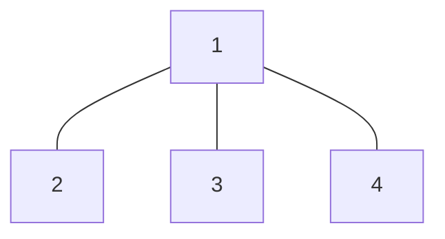

所以：$\deg(1)=3$, $\deg(2)=1$

---

### Handshaking Lemma

在 Undirected Graph 中，每一條 Edge 都會對兩個端點各貢獻一次 Degree。

因此：

$$
\sum_{v\in V}\deg(v)=2|E|
$$

這個性質稱為：

> **Handshaking Lemma**

---

## Path

假設：

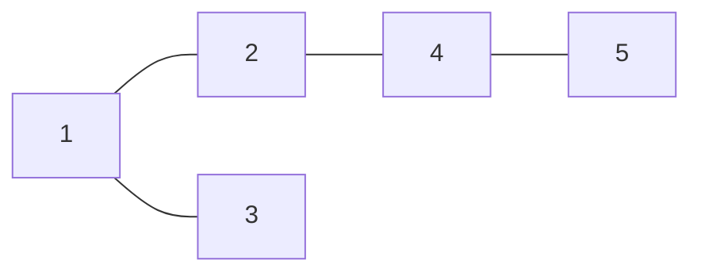

從 Vertex $1$ 可以沿著：

$$
1\rightarrow2\rightarrow4\rightarrow5
$$

走到 Vertex $5$。

這樣的一連串 Vertex 稱為：

> **Path（路徑）**

更正式地說，如果：

$$
v_1,v_2,\ldots,v_k
$$

滿足：

$$
(v_i,v_{i+1})\in E
$$

那麼它們形成一條 Path。

---

## Cycle

如果一條 Path 最後又回到原點，就可能形成：

> **Cycle（環）**

例如：

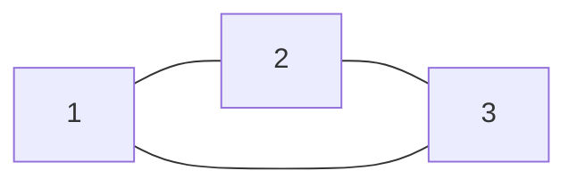

存在：

$$
1\rightarrow2\rightarrow3\rightarrow1
$$

因此形成一個 Cycle。

---

## Connected

如果任意兩個 Vertex 之間都存在 Path，我們稱這張 Graph：

> **Connected（連通）**

例如：

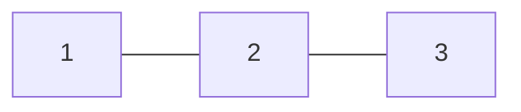

Vertex $1$ 可以透過：

$$
1\rightarrow2\rightarrow3
$$

走到 Vertex $3$。

因此這張 Graph 是 Connected。

---

## Connected Component

考慮：

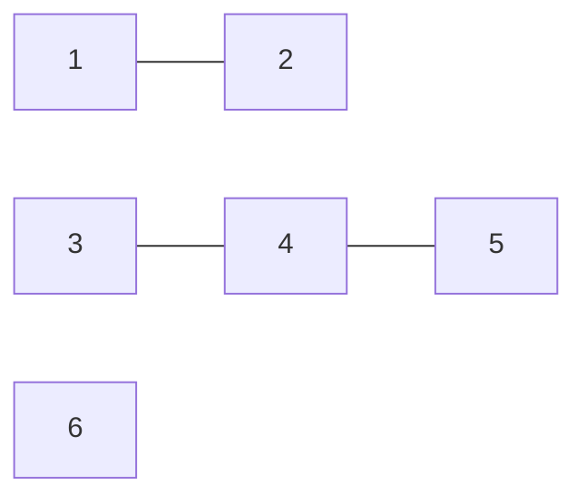

它可以分成：$\{1,2\}, \{3,4,5\}, \{6\}$

每一組內的 Vertex 都互相可以到達。

這樣的區域稱為：

> **Connected Component（連通分量）**

因此這張 Graph 有 $3$ 個 Connected Components。

---

## Tree

Tree 是一張：

1. Connected
2. 沒有 Cycle

的 Undirected Graph。

例如：

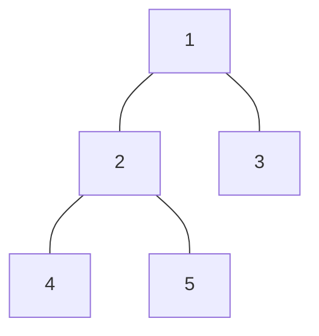

這是一棵 Tree。

---

### Tree 的重要性質

如果一棵 Tree 有 $n$ 個 Vertex，那麼一定恰好有 $n-1$ 條 Edge。

## Graph 的儲存方式

知道 Graph 是 $G=(V,E)$ 之後，下一個問題是：

**我們要怎麼在程式中儲存一張 Graph？**

假設有下面這張 Undirected Graph：

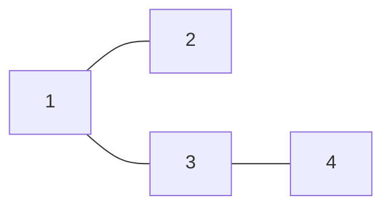

它的 Edge 集合為：

$E={(1,2),(1,3),(3,4)}$

常見的 Graph 儲存方式有：

* Edge List
* Adjacency Matrix
* Adjacency List

不同方法適合不同情境。

---

### Edge List

最直接的方法就是：

**直接把所有 Edge 存起來。**

例如 Graph：


可以存成：

```text
1 2
1 3
3 4
```

Kotlin：

```kotlin
val edges = mutableListOf<Pair<Int, Int>>()

repeat(m)
{
    val (u, v) = readln()
        .split(" ")
        .map{ it.toInt() }

    edges += u to v
}
```

因此 `edges` 代表整張 Graph 的所有 Edge。

---

#### Edge List 的優點

最大的優點是：

**非常簡單。**

只需要存 $m$ 條 Edge，因此空間複雜度為：

$O(m)$

如果演算法本身主要是：

**依序處理所有 Edge**

那 Edge List 非常方便。

例如：

* Kruskal's Algorithm
* Bellman-Ford
* 一些 Edge sorting 問題

例如 Kruskal 常常需要：

```kotlin
edges.sortedBy { it.weight }
```

這時 Edge List 就很自然。

---

#### Edge List 的缺點

如果現在問：

**Vertex $u$ 有哪些 Neighbor？**

Edge List 就不太方便。

因為必須把所有 Edge 掃過一次。

```kotlin
edges.filter { (u, v) ->
    u == target || v == target
}
```

這個操作需要 $O(m)$。

因此 Edge List 不適合頻繁進行：

* 找 Neighbor
* DFS
* BFS

---

### Adjacency Matrix

另一種方法是使用一個 $n\times n$ 的矩陣。

定義：

$adj[u][v]$

表示：

**Vertex $u$ 和 Vertex $v$ 之間是否存在 Edge。**

例如：


可以表示成：

|   |  1 |  2 |  3 |  4 |
| - | -: | -: | -: | -: |
| 1 |  0 |  1 |  1 |  0 |
| 2 |  1 |  0 |  0 |  0 |
| 3 |  1 |  0 |  0 |  1 |
| 4 |  0 |  0 |  1 |  0 |

例如：

$adj[1][2]=1$

表示存在 Edge：

$1-2$

而：

$adj[2][4]=0$

表示不存在 Edge：

$2-4$

---

#### 實作

```kotlin
val graph = Array(n + 1) {
    BooleanArray(n + 1)
}
```

讀入一條 Undirected Edge：

```kotlin
graph[u][v] = true
graph[v][u] = true
```

完整：

```kotlin
val graph = Array(n + 1) {
    BooleanArray(n + 1)
}

repeat(m)
{
    val (u, v) = readln()
        .split(" ")
        .map{ it.toInt() }

    graph[u][v] = true
    graph[v][u] = true
}
```

---

#### Adjacency Matrix 的優點

最大的優點是：

**可以非常快速判斷兩點之間是否存在 Edge。**

例如：

```kotlin
graph[u][v]
```

只需要 $O(1)$。

因此如果題目常常詢問：

**$u$ 和 $v$ 是否相連？**

Adjacency Matrix 很方便。

---

#### Adjacency Matrix 的缺點

最大的問題是空間。

需要：

$O(n^2)$

的記憶體。

如果 $n=100000$：

$n^2=10^{10}$

幾乎不可能直接儲存。

另外，如果我們想找：

**Vertex $u$ 的所有 Neighbor**

必須檢查：

```kotlin
for (v in 1..n)
{
    if (graph[u][v])
    {
        // v is a neighbor
    }
}
```

即使 Vertex $u$ 只有兩個 Neighbor，也仍然需要掃描 $n$ 個 Vertex。

因此找 Neighbor 需要 $O(n)$。

---

### Adjacency List

在大部分 Graph Algorithm 中，最常用的方法是：

**Adjacency List（鄰接串列）**

概念是：

**對每個 Vertex，只儲存它真正存在的 Neighbor。**

例如：


可以表示成：

```text
1: 2 3
2: 1
3: 1 4
4: 3
```

也就是：

$N(1)={2,3}$

$N(2)={1}$

$N(3)={1,4}$

$N(4)={3}$

---

#### 實作

```kotlin
val graph = List(n + 1) {
    mutableListOf<Int>()
}
```

如果讀入一條 Undirected Edge：

$u-v$

因為兩邊都可以走，所以：

```kotlin
graph[u] += v
graph[v] += u
```

完整：

```kotlin
val graph = List(n + 1) {
    mutableListOf<Int>()
}

repeat(m)
{
    val (u, v) = readln()
        .split(" ")
        .map{ it.toInt() }

    graph[u] += v
    graph[v] += u
}
```

這樣：

```kotlin
graph[u]
```

就是 Vertex $u$ 的所有 Neighbor。

---

### Directed Graph

如果 Graph 是 Directed Graph：

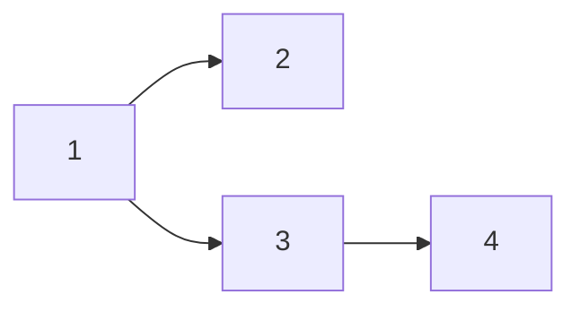

讀入 Edge：

$u\rightarrow v$

只需要：

```kotlin
graph[u] += v
```

而不能加入：

```kotlin
graph[v] += u
```

因為 Direction 不一定可以反過來。

---

### Weighted Graph

如果 Edge 帶有 Weight：

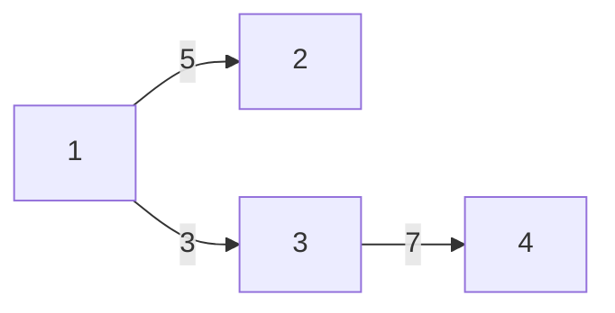

例如：

$1\rightarrow2$

的 Weight 為 $5$。

可以把 Neighbor 與 Weight 一起存：

```kotlin
val graph = List(n + 1) {
    mutableListOf<Pair<Int, Long>>()
}
```

讀入：

```kotlin
val (u, v, w) = readln()
    .split(" ")
    .map{ it.toLong() }

graph[u.toInt()] += v.toInt() to w
```

之後：

```kotlin
graph[u].forEach { (v, w) ->
    // edge u -> v with weight w
}
```

---

### 三種儲存方法比較

| 方法               |       空間 | 判斷 $u-v$ 是否存在 | 找 $u$ 的 Neighbor | 常見用途                        |
| ---------------- | -------: | ------------: | ---------------: | --------------------------- |
| Edge List        |   $O(m)$ |        $O(m)$ |           $O(m)$ | Kruskal、處理所有 Edge           |
| Adjacency Matrix | $O(n^2)$ |        $O(1)$ |           $O(n)$ | Dense Graph、快速查 Edge        |
| Adjacency List   | $O(n+m)$ |  $O(\deg(u))$ |     $O(\deg(u))$ | DFS、BFS、大部分 Graph Algorithm |

在 Competitive Programming 中，如果沒有特殊需求：

**通常優先選擇 Adjacency List。**

因為大部分 Graph 都是 Sparse Graph。

也就是：

$m\ll n^2$

Adjacency List 不需要儲存不存在的 Edge，因此更加節省空間。

---

## Sparse Graph 與 Dense Graph

假設 Graph 有 $n$ 個 Vertex。

Undirected Simple Graph 最多有：

$\frac{n(n-1)}{2}$

條 Edge。

如果 Edge 數量接近 $n^2$，通常稱為：

**Dense Graph**

如果 Edge 數遠小於 $n^2$，通常稱為：

**Sparse Graph**

例如 Tree：

$m=n-1$

就是非常典型的 Sparse Graph。

因此 Tree 幾乎一定使用 Adjacency List。

---

## Depth First Search

有了 Graph 的儲存方式後，我們終於可以開始：

**Traversal Graph。**

考慮下面的 Graph：

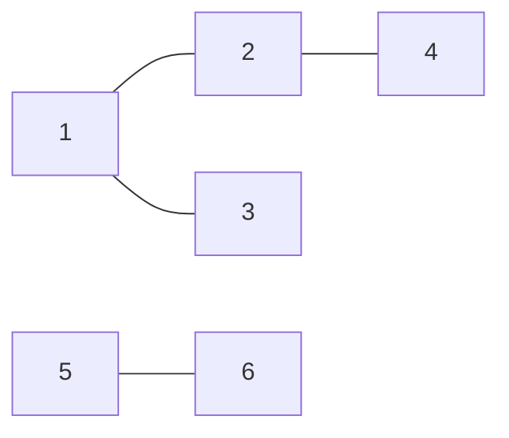

現在我們想回答：

**從 Vertex $1$ 出發，可以到達哪些 Vertex？**

從 Vertex $1$ 可以走到：

${1,2,3,4}$

但無法走到：

${5,6}$

一個自然的做法是：

1. 拜訪目前 Vertex
2. 查看它的 Neighbor
3. 找一個還沒拜訪過的 Neighbor
4. 前往那個 Vertex
5. 重複相同的事情

注意最後一步。

到了下一個 Vertex 之後：

**我們做的是完全相同的事情。**

這就是很典型的 Recursive Structure。

考慮：


假設 Neighbor 按照編號順序處理。

從 Vertex $1$ 開始：

```text
1
```

先走到：

```text
1 -> 2
```

接著不要急著處理 Vertex $3$。

繼續往深處：

```text
1 -> 2 -> 4
```

Vertex $4$ 已經沒有新的 Neighbor。

所以回到 Vertex $2$，再走：

```text
1 -> 2 -> 5
```

最後才回到 Vertex $1$：

```text
1 -> 3
```

因此可能得到：

```text
1 2 4 5 3
```

這就是：

**Depth First。**

---

### 為什麼需要 visited？

考慮最簡單的 Undirected Graph：


如果我們直接：

```text
DFS(1)
    DFS(2)
        DFS(1)
            DFS(2)
                ...
```

會無限重複。

因為從 $1$ 可以走到 $2$，而從 $2$ 又可以走回 $1$。

所以我們需要記錄：

**哪些 Vertex 已經拜訪過。**

```kotlin
val visited = BooleanArray(n + 1)
```

拜訪 $u$：

```kotlin
visited[u] = true
```

只處理沒有拜訪過的 Neighbor：

```kotlin
graph[u]
    .filter { !visited[it] }
```

---

### DeepRecursiveFunction

最直覺的 Recursive DFS 是：

```kotlin
fun dfs(u: Int)
{
    visited[u] = true

    graph[u]
        .filter { !visited[it] }
        .forEach(::dfs)
}
```

但是如果 Graph 很深：

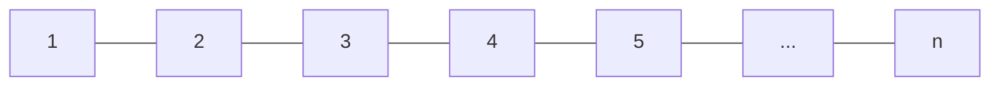

Recursive call 可能變成：

```text
dfs(1)
    dfs(2)
        dfs(3)
            dfs(4)
                ...
```

當遞迴深度過大時，JVM 可能發生：

```text
StackOverflowError
```

如果我們希望：

**保留 Recursive DFS 的寫法，同時能處理很深的 Graph**

可以使用 Kotlin 的：

```kotlin
DeepRecursiveFunction
```

---

### DeepRecursiveFunction DFS

```kotlin
val visited = BooleanArray(n + 1)

val dfs = DeepRecursiveFunction<Int, Unit> { u ->
    visited[u] = true

    graph[u]
        .filter { !visited[it] }
        .forEach { callRecursive(it) }
}
```

開始：

```kotlin
dfs(1)
```

其中：

```kotlin
callRecursive(v)
```

就代表：

**繼續對 Vertex $v$ 做 DFS。**

這種寫法仍然保留 Recursive DFS 很重要的結構：

```text
處理自己
    ↓
處理 Neighbor
    ↓
Recursive Call
```

---

### Connected Component

考慮：

```mermaid
graph LR
    1 --- 2

    3 --- 4
    4 --- 5

    6
```

首先：

```kotlin
dfs(1)
```

會拜訪：

${1,2}$

接著 Vertex $2$ 已經被拜訪，因此跳過。

遇到 Vertex $3$：

```kotlin
dfs(3)
```

會拜訪：

${3,4,5}$

最後 Vertex $6$ 還沒有被拜訪：

```kotlin
dfs(6)
```

因此總共啟動 DFS 三次。

也就是有 $3$ 個 Connected Components。

---

#### Connected Component 實作

```kotlin
val visited = BooleanArray(n + 1)

val dfs = DeepRecursiveFunction<Int, Unit> { u ->
    visited[u] = true

    graph[u]
        .filter { !visited[it] }
        .forEach { callRecursive(it) }
}

val components = (1..n).count { u ->
    if (visited[u])
    {
        false
    }
    else
    {
        dfs(u)
        true
    }
}

println(components)
```

這裡：

```kotlin
(1..n).count { ... }
```

實際上是在計算：

**有多少個 Vertex 需要成為新的 DFS 起點。**

---

### DFS 複雜度

使用 Adjacency List 時：

每個 Vertex 最多拜訪一次，因此需要 $O(|V|)$。

每條 Edge 只會被檢查固定次數，因此需要 $O(|E|)$。

所以總時間複雜度為：

$O(|V|+|E|)$

通常也寫成：

$O(n+m)$

---

## Breadth First Search

DFS 的探索方式是：

**先一路往深處走。**

但現在考慮另外一個問題：

```mermaid
graph TD
    1 --- 2
    1 --- 3
    2 --- 4
    2 --- 5
    3 --- 6
```

如果從 Vertex $1$ 出發，我們希望依照距離處理：

* distance $0$：$1$
* distance $1$：$2,3$
* distance $2$：$4,5,6$

也就是：

**先處理離起點比較近的 Vertex。**

這時候使用：

**Breadth First Search**

簡稱：

**BFS**

中文稱為：

**廣度優先搜尋**

---

### BFS 的直覺

DFS 是：

**一路往深處。**

BFS 則比較像水波：

```mermaid
graph TD
    1 --- 2
    1 --- 3
    2 --- 4
    2 --- 5
    3 --- 6
```

從 Vertex $1$ 開始：

```text
1
```

第一層：

```text
2 3
```

第二層：

```text
4 5 6
```

所以 BFS 的核心是：

**一層一層往外探索。**

---

### 為什麼 BFS 使用 Queue？

假設先找到：

```text
2 3
```

因為 Vertex $2$ 比 Vertex $3$ 更早被發現，所以它應該更早被處理。

也就是：

**First In, First Out**

因此使用：

**Queue**

Kotlin 可以使用：

```kotlin
val queue = ArrayDeque<Int>()
```

加入 Queue：

```kotlin
queue.addLast(v)
```

從 Queue 前端取出：

```kotlin
queue.removeFirst()
```

---

### BFS 基本寫法

```kotlin
val visited = BooleanArray(n + 1)
val queue = ArrayDeque<Int>()

visited[1] = true
queue.addLast(1)

while (queue.isNotEmpty())
{
    val u = queue.removeFirst()

    graph[u]
        .filter { !visited[it] }
        .forEach { v ->
            visited[v] = true
            queue.addLast(v)
        }
}
```

注意：

```kotlin
visited[v] = true
```

應該在：

**加入 Queue 的時候**

就設定。

否則同一個 Vertex 可能被不同 Neighbor 重複加入 Queue。

---

### BFS 與 Shortest Path

BFS 最重要的用途之一是：

**Unweighted Graph 的 Shortest Path。**

定義：

$dist[v]$

表示從起點到 Vertex $v$ 最少經過幾條 Edge。

如果起點為 $s$：

$dist[s]=0$

當我們第一次從 Vertex $u$ 發現 Vertex $v$：

$dist[v]=dist[u]+1$

---

#### BFS Shortest Path

```kotlin
val dist = IntArray(n + 1) { -1 }
val queue = ArrayDeque<Int>()

dist[1] = 0
queue.addLast(1)

while (queue.isNotEmpty())
{
    val u = queue.removeFirst()

    graph[u]
        .filter { dist[it] == -1 }
        .forEach { v ->
            dist[v] = dist[u] + 1
            queue.addLast(v)
        }
}
```

這裡不需要：

```kotlin
visited
```

因為：

```kotlin
dist[v] == -1
```

本身就表示：

**Vertex $v$ 還沒有被拜訪。**

---

### 為什麼 BFS 找得到 Shortest Path？

BFS 一定按照距離：

$0,1,2,3,\ldots$

的順序探索。

所以當 Vertex $v$ 第一次被找到時，它一定是透過目前最短的 Path 被找到。

因此：

**BFS 可以找 Unweighted Graph 的 Shortest Path。**

---

### BFS 複雜度

與 DFS 一樣：

$O(|V|+|E|)$

也就是：

$O(n+m)$

---

## DFS vs BFS

| DFS                 | BFS                      |
| ------------------- | ------------------------ |
| Depth First         | Breadth First            |
| 先往深處                | 先往附近                     |
| Recursive / Stack   | Queue                    |
| Graph traversal     | Graph traversal          |
| Connected Component | Connected Component      |
| Cycle Detection     | Unweighted Shortest Path |

可以先簡單記成：

**DFS：深。**

**BFS：廣。**

---

## Topological Sort

現在考慮 Directed Graph。

假設有課程先修關係：

```mermaid
graph LR
    Programming --> DS["Data Structure"]
    DS --> Algorithm
```

代表：

$Programming\rightarrow DataStructure$

以及：

$DataStructure\rightarrow Algorithm$

如果 $u\rightarrow v$ 代表：

**必須先完成 $u$，才能做 $v$**

那麼我們想找的是：

**一個滿足所有 dependency 的執行順序。**

這就是：

**Topological Sort（拓撲排序）**

---

### Topological Order

如果 Directed Graph 中存在：

$u\rightarrow v$

那麼合法的 Topological Order 必須滿足：

$pos(u)<pos(v)$

也就是：

**$u$ 必須出現在 $v$ 前面。**

---

### Directed Acyclic Graph

不是每張 Directed Graph 都存在 Topological Order。

考慮：

```mermaid
graph LR
    1 --> 2
    2 --> 3
    3 --> 1
```

這代表：

$1$ 必須在 $2$ 前面，

$2$ 必須在 $3$ 前面，

但 $3$ 又必須在 $1$ 前面。

形成矛盾。

因此：

**有 Directed Cycle 的 Graph 不存在 Topological Order。**

能進行 Topological Sort 的 Graph 稱為：

**Directed Acyclic Graph**

簡稱：

**DAG**

也就是：

**Directed + Acyclic**

---

### In-degree

對 Directed Graph 而言：

$indeg(v)$

表示：

**有多少條 Edge 指向 Vertex $v$。**

例如：

```mermaid
graph TD
    1 --> 3
    2 --> 3
    3 --> 4
```

所以：

$indeg(1)=0$

$indeg(2)=0$

$indeg(3)=2$

$indeg(4)=1$

---

### 為什麼從 In-degree = 0 開始？

如果：

$indeg(v)=0$

代表目前沒有任何 prerequisite 必須排在 Vertex $v$ 前面。

因此：

**Vertex $v$ 現在可以被處理。**

這就是：

**Kahn's Algorithm**

的核心。

---

### Kahn's Algorithm

先計算所有 In-degree：

```kotlin
val indegree = IntArray(n + 1)

for (u in 1..n)
{
    graph[u].forEach { v ->
        indegree[v]++
    }
}
```

接著將所有：

$indeg(v)=0$

的 Vertex 放進 Queue：

```kotlin
val queue = ArrayDeque<Int>()

(1..n)
    .filter { indegree[it] == 0 }
    .forEach(queue::addLast)
```

---

### Topological Sort

```kotlin
val order = mutableListOf<Int>()
val queue = ArrayDeque<Int>()

(1..n)
    .filter { indegree[it] == 0 }
    .forEach(queue::addLast)

while (queue.isNotEmpty())
{
    val u = queue.removeFirst()

    order += u

    graph[u].forEach { v ->
        if (--indegree[v] == 0)
        {
            queue.addLast(v)
        }
    }
}
```

當：

```kotlin
val u = queue.removeFirst()
```

代表 Vertex $u$ 已經沒有未完成的 prerequisite。

所以可以：

```kotlin
order += u
```

接著對每條 Edge $u\rightarrow v$：

```kotlin
indegree[v]--
```

意思是：

**Vertex $v$ 少了一個還沒處理完的 prerequisite。**

如果：

```kotlin
indegree[v] == 0
```

就代表 Vertex $v$ 現在也可以開始處理。

---

### Cycle Detection

如果 Graph 是 DAG，最後一定能處理所有 $n$ 個 Vertex。

因此：

```kotlin
order.size == n
```

代表存在合法的 Topological Order。

如果：

```kotlin
order.size != n
```

代表某些 Vertex 永遠無法讓 In-degree 變成 $0$。

因此 Graph 中存在 Directed Cycle。

```kotlin
if (order.size != n)
{
    println("Cycle")
}
```

---

### 完整 Kahn's Algorithm

```kotlin
fun main()
{
    val (n, m) = readln()
        .split(" ")
        .map(String::toInt)

    val graph = List(n + 1) {
        mutableListOf<Int>()
    }

    val indegree = IntArray(n + 1)

    repeat(m)
    {
        val (u, v) = readln()
            .split(" ")
            .map(String::toInt)

        graph[u] += v
        indegree[v]++
    }

    val queue = ArrayDeque<Int>()

    (1..n)
        .filter { indegree[it] == 0 }
        .forEach(queue::addLast)

    val order = buildList {
        while (queue.isNotEmpty())
        {
            val u = queue.removeFirst()

            add(u)

            graph[u].forEach { v ->
                if (--indegree[v] == 0)
                {
                    queue.addLast(v)
                }
            }
        }
    }

    if (order.size == n)
    {
        println(order.joinToString(" "))
    }
    else
    {
        println("Cycle")
    }
}
```

---

### DFS Topological Sort

Topological Sort 也可以使用 DFS。

考慮：

```mermaid
graph LR
    1 --> 2
    2 --> 3
```

DFS 過程：

```text
dfs(1)
    dfs(2)
        dfs(3)
```

Vertex $3$ 最先完成，所以先加入答案。

接著是 $2$，最後是 $1$：

```text
3 2 1
```

反轉後：

```text
1 2 3
```

就是合法的 Topological Order。

核心想法是：

**所有後繼都完成之後，才把自己加入答案。**

---

### DeepRecursiveFunction Topological Sort

```kotlin
val visited = BooleanArray(n + 1)
val order = mutableListOf<Int>()

val dfs = DeepRecursiveFunction<Int, Unit> { u ->
    visited[u] = true

    graph[u]
        .filter { !visited[it] }
        .forEach { callRecursive(it) }

    order += u
}

(1..n)
    .filter { !visited[it] }
    .forEach { dfs(it) }

println(order.asReversed().joinToString(" "))
```

其中：

```kotlin
order += u
```

是在所有後繼都處理完成後執行。

這種順序稱為：

**Postorder**

---

#### 為什麼 visited 不夠？

如果還需要偵測 Cycle：

```mermaid
graph LR
    1 --> 2
    2 --> 3
    3 --> 1
```

單純使用：

```kotlin
visited[v]
```

只能知道 Vertex $v$：

**曾經拜訪過。**

但我們還需要知道：

**Vertex $v$ 是否仍然存在於目前的 DFS path。**

因此通常使用三種狀態：

```text
0 = unvisited
1 = visiting
2 = finished
```

---

### DFS Cycle Detection

```kotlin
val state = IntArray(n + 1)
var hasCycle = false

val dfs = DeepRecursiveFunction<Int, Unit> { u ->
    state[u] = 1

    graph[u].forEach { v ->
        when (state[v])
        {
            0 -> callRecursive(v)
            1 -> hasCycle = true
        }
    }

    state[u] = 2
}
```

如果：

```kotlin
state[v] == 1
```

代表 Vertex $v$：

**還在目前 DFS recursion path 裡。**

卻又被走到一次。

這種 Edge 稱為：

**Back Edge**

因此存在 Directed Cycle。

---

### DFS Topological Sort + Cycle Detection

```kotlin
val state = IntArray(n + 1)
val order = mutableListOf<Int>()

var hasCycle = false

val dfs = DeepRecursiveFunction<Int, Unit> { u ->
    state[u] = 1

    graph[u].forEach { v ->
        when (state[v])
        {
            0 -> callRecursive(v)
            1 -> hasCycle = true
        }
    }

    state[u] = 2
    order += u
}

(1..n)
    .filter { state[it] == 0 }
    .forEach { dfs(it) }

if (hasCycle)
{
    println("Cycle")
}
else
{
    println(order.asReversed().joinToString(" "))
}
```

---

### Kahn vs DFS Topological Sort

| Kahn's Algorithm    | DFS                 |
| ------------------- | ------------------- |
| Queue               | Recursive DFS       |
| 使用 In-degree        | 使用 finishing order  |
| BFS 思想              | DFS 思想              |
| Cycle detection 很直覺 | 需要三種 state          |
| 很適合 dependency      | 很適合理解 DFS structure |

可以記成：

**Kahn：一直處理 In-degree 為 $0$ 的 Vertex。**

**DFS：所有後繼完成後，再把自己加入答案。**

---

## 複雜度整理

使用 Adjacency List：

| Algorithm            | Time Complexity |
| -------------------- | --------------: |
| DFS                  |        $O(n+m)$ |
| BFS                  |        $O(n+m)$ |
| Connected Components |        $O(n+m)$ |
| Topological Sort     |        $O(n+m)$ |

它們之所以都是 $O(n+m)$，是因為：

**每個 Vertex 和 Edge 都只被處理固定次數。**

---

## 方法整理

| 問題                       | 建議方法                    |
| ------------------------ | ----------------------- |
| 從 $s$ 能不能到 $t$           | DFS / BFS               |
| Connected Components 數量  | DFS / BFS               |
| Unweighted Shortest Path | BFS                     |
| Tree Traversal           | DFS                     |
| Directed Cycle Detection | DFS / Kahn              |
| Dependency Ordering      | Topological Sort        |
| Deep Recursive Graph     | `DeepRecursiveFunction` |

---

## Summary

Graph 常見的三種儲存方式：

| Storage          | 特點                                          |
| ---------------- | ------------------------------------------- |
| Edge List        | 最簡單，適合直接處理所有 Edge                           |
| Adjacency Matrix | $O(1)$ 查詢 Edge，但需要 $O(n^2)$ 空間              |
| Adjacency List   | 適合 Sparse Graph，也是最常見的 Graph representation |

而 Graph Traversal 最重要的兩個方法：

**DFS：一路往深處探索。**

**BFS：按照距離一層一層探索。**

在 Directed Graph 中，如果需要處理 Dependency：

**Topological Sort：按照 prerequisite 關係安排順序。**

這三個思想：

$DFS$

$BFS$

$Topological\ Sort$

會成為後續大部分 Graph Algorithm 的基礎。

## 題單

- []
